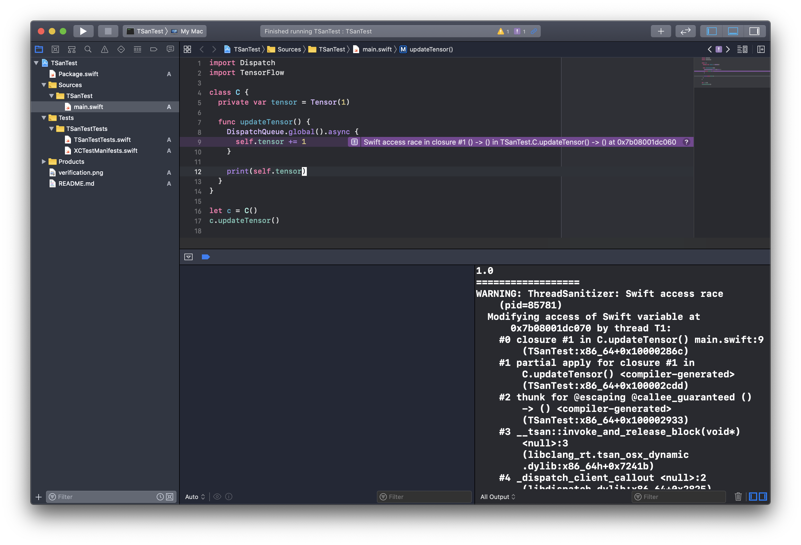

# TSanTest

Testing whether Thread Sanitizer in Xcode works with custom Swift toolchains (Swift for TensorFlow).

Verified that it works (with `Swift for TensorFlow Development Snapshot 2020-07-16` selected in Xcode):

Related to https://github.com/tensorflow/swift/issues/500.
