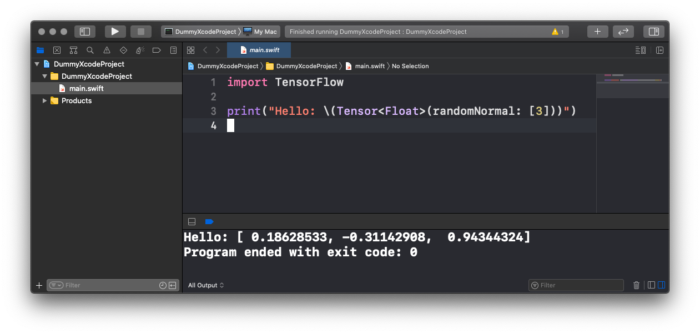

A dummy Xcode project.

Failed to reproduce https://github.com/tensorflow/swift/issues/532 with the [`tensorflow-DEVELOPMENT-2020-09-03-a` macOS toolchain](https://storage.googleapis.com/swift-tensorflow-artifacts/macos-toolchains/swift-tensorflow-DEVELOPMENT-2020-09-03-a-osx.pkg) and Xcode 12 beta 4.

Xcode runs fine: there is no "Could not launch LLDB provided no error string" error dialog.
